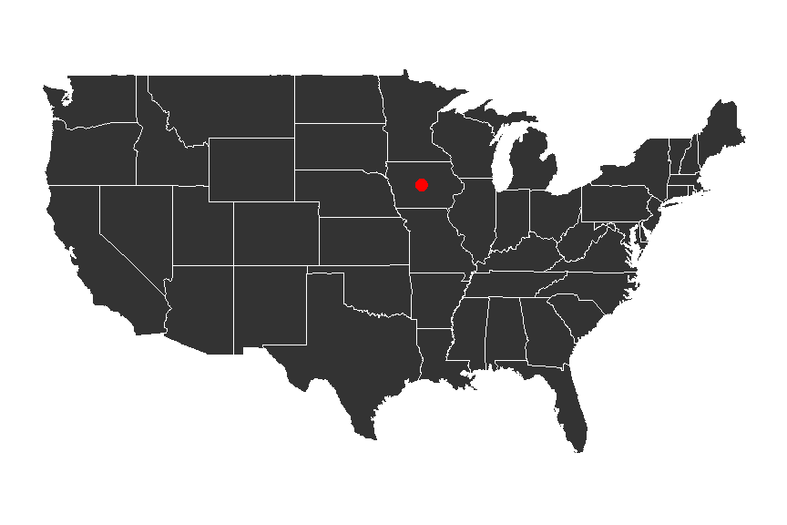

DATA 621 Final Presentation 
========================================================
author: Omer Ozeren
date: 05/15/2020
autosize: true

Introduction - PART I
========================================================

***

* Understanding the factors that go into buying a house is important.
* Investigated prices in Aimes Iowa.
* Most important factors:
  * Location
  * Condition
  

Introduction - PART II
========================================================

***
The data was originally published in the Journal of Statistics Education (Volume 19, Number 3) as a juxtaposition to the Boston housing dataset. It is now part of a long running Kaggle competition.

The 79 explanatory features describe attributes of the houses such as conditions, zoning, and neighborhood. They are both numeric and categorical.

Literature Review
========================================================

* Environmental attributes can impact sale prices substantially : These include views, land contours, greenery, and proximity to schooling (Luttik, 2000).  

* Simply assessing the attributes of a house by number and conditional qualities of rooms is not not sufficient. (i.e. Two beautiful half-bathrooms does not equate to two beautiful bathroom suites.(Pardoe, 2008)) The caveat to including whether or not the bathroom is a half-bathroom or not; creates tedious datasets, confounding variables, and issue of where to draw the line of specificity.  

* A proposed approach to modeling housing sale prices, would be a hedonic regression. Simply put, analyze the factors of a house, group attributes to those factors, and make several different regressions, leading to one output.(Downes, 2002)

Methodology 1
=============

The data is split almost equally into training and test data. 

## Data imputation
Some NA values like pool quality were `NA` if there was no pool. values like this were updated
to reflect their actual abscence of.

After the features were fixed, 2% of missing values remained.
***

Methodology 2
=============

Values for both categorical and continuous variables were imputed using `mice` and the random Forrest imputation method.

The density plots for the various imputed values can be see here. 

***

Transformations
===============

I created a new variable, age, which was the age at which the house was sold. Any negative values were set to zero.

Ordered categorical variables such as `HeatingQC` that did not have overlapping interquartile ranges were changed to a single dummy variable. For example, if `HeatingQC == Excellent` and `HeatingQC != Excellent` did not have overlapping IQRs, they would be transformed into a dummy variable. This increases on degrees of freedom.

Interaction terms were created via a grid search and selected based on their individual $R^2$ values.

Transformations 2
=================

Finally a Box-Cox transformation was performed. The optimal $\lambda$ was found to be 0.184. This means that the response variable `SalePrice` was raised to the 0.184 power.

$${Y}(\lambda)  = \begin{cases} \frac { { y }^{ \lambda  } - 1 }{ \lambda }, & \text{if}\ \lambda \neq 0 \\ log(y), & \text{if}\ \lambda = 0 \end{cases}$$  

Visible in the scatter plots, many of the relationships become more linear. 

***

Modeling
========
There were six models used: 

<table class="table" style="font-size: 12px; margin-left: auto; margin-right: auto;">
 <thead>
  <tr>
   <th style="text-align:left;"> Model </th>
   <th style="text-align:right;"> Multiple R^2 </th>
   <th style="text-align:right;"> Adjusted R^2 </th>
   <th style="text-align:right;"> AIC </th>
   <th style="text-align:right;"> Kaggle Score </th>
   <th style="text-align:left;"> Description </th>
  </tr>
 </thead>
<tbody>
  <tr>
   <td style="text-align:left;"> Model 1 (Box-Cox) </td>
   <td style="text-align:right;"> 0.9359 </td>
   <td style="text-align:right;"> 0.9241 </td>
   <td style="text-align:right;"> -531 </td>
   <td style="text-align:right;"> NA </td>
   <td style="text-align:left;"> All variables, Box-Cox and other transformations </td>
  </tr>
  <tr>
   <td style="text-align:left;"> Model 2 (Box-Cox) </td>
   <td style="text-align:right;"> 0.9330 </td>
   <td style="text-align:right;"> 0.9252 </td>
   <td style="text-align:right;"> -617 </td>
   <td style="text-align:right;"> NA </td>
   <td style="text-align:left;"> Model 1 with backwards stepwise regression, not statistically different </td>
  </tr>
  <tr>
   <td style="text-align:left;"> Model 3 (Box-Cox) </td>
   <td style="text-align:right;"> 0.8934 </td>
   <td style="text-align:right;"> 0.8890 </td>
   <td style="text-align:right;"> -126 </td>
   <td style="text-align:right;"> NA </td>
   <td style="text-align:left;"> Only highly significant variables  selected. Significant difference from model 1 </td>
  </tr>
  <tr>
   <td style="text-align:left;"> Model 4 (Box-Cox) </td>
   <td style="text-align:right;"> 0.9193 </td>
   <td style="text-align:right;"> 0.9131 </td>
   <td style="text-align:right;"> -440 </td>
   <td style="text-align:right;"> NA </td>
   <td style="text-align:left;"> Only results with p&lt;0.01 selected. </td>
  </tr>
  <tr>
   <td style="text-align:left;"> Model 5 (Original) </td>
   <td style="text-align:right;"> 0.8935 </td>
   <td style="text-align:right;"> 0.8857 </td>
   <td style="text-align:right;"> -1604 </td>
   <td style="text-align:right;"> 0.14751 </td>
   <td style="text-align:left;"> This model uses the original data with log transformed price and area </td>
  </tr>
  <tr>
   <td style="text-align:left;"> Model 6 (Transformed) </td>
   <td style="text-align:right;"> 0.9183 </td>
   <td style="text-align:right;"> 0.9120 </td>
   <td style="text-align:right;"> -1982 </td>
   <td style="text-align:right;"> 0.13846 </td>
   <td style="text-align:left;"> Based on model 4 but with interactions and no Box-Cox </td>
  </tr>
</tbody>
</table>

Model Selection
===

During model evaluation, Models 5 & 6 was chosen as most valid. Model tuning was performed through K-fold validation. Four leverage points were removed, and categorical variables *Condition2* and *Utilities* were removed for poor sample distribution.  

Afterwards, adjusted model 6 had the best performance both on the training data, as well as the best kaggle score. As such, we are not worried about over fitting. It had multiple R2 of 0.9276, adjusted R2 of 0.9225, AIC of -2172 and Kaggle score of 0.13376. These are the best values in all categories.

***

Conclusion
=== 
  Examining the model coefficients, Variables with the most powerful coefficients included features that are only obtainable in certain areas. Such as pools, garages, neighborhood, and the contour of land. Where as the lowest coefficients included shapes, styles, and building materials. 

  Other factors such as condition also played a role. Further, it is unlikely that this model will transfer to other geographic areas and should only be used to estimate houses in the mid west. In particular, university towns such as this one where off-campus housing may dictate a large portion of sale price. 

